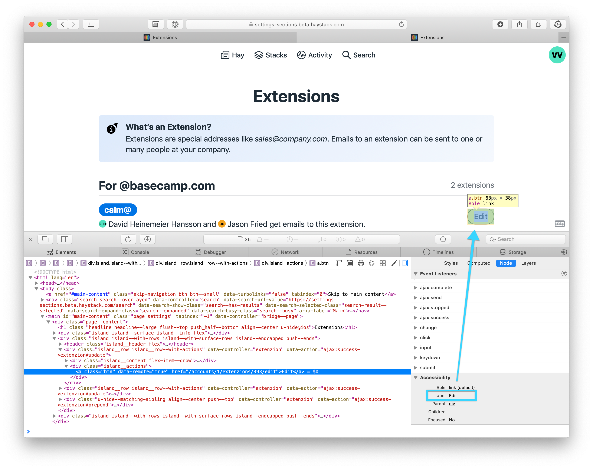
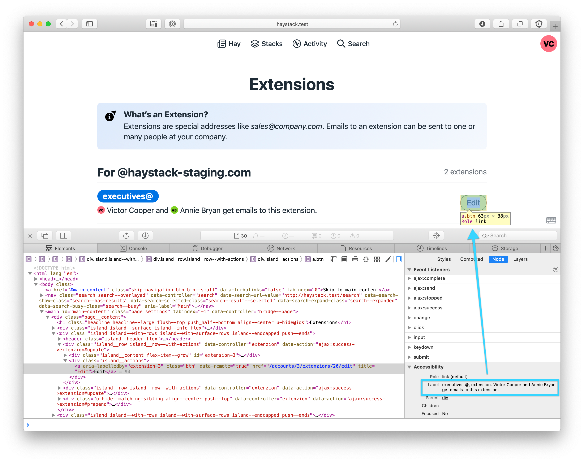

# Designing for Accessibility on the Web

1. [General Resources](#general-resources)
2. [Heading levels should be sequential](#heading-levels-should-be-sequential)
3. [Use appropriate landmarks for each section of page content](#use-appropriate-landmarks-for-each-section-of-page-content)
4. [Don't hide focus indicators](#dont-hide-focus-indicators)
5. [Links should convey the full context of the action](#links-should-convey-the-full-context-of-the-action)
6. [Use non-visual spans to sprinkle in context](#use-non-visual-spans-to-sprinkle-in-context)
7. [Hide decorative and redundant elements (like avatar SVGs) from screen readers](#hide-decorative-and-redundant-elements-like-avatar-svgs-from-screen-readers)
8. [Screen reader must announce any changes that occur on screen](#screen-reader-must-announce-any-changes-that-occur-on-screen)
9. [Don’t use characters in CSS as separators; screen readers will speak them](#dont-use-characters-in-css-as-separators-screen-readers-will-speak-them)
10. [Include a skip navigation link so getting to the main page content is easy](#include-a-skip-navigation-link-so-getting-to-the-main-page-content-is-easy)
11. [Infinite scrolling role and state](#infinite-scrolling-role-and-state)
12. [Don't use the `title` attribute](#dont-use-the-title-attribute)

---

## General Resources

* [W3C Web Accessibility Tutorials](https://www.w3.org/WAI/tutorials/): A great overview of how to make sure common elements are accessible.

## Heading levels should be sequential

*Who is this for?* People using a screen reader

Someone using a screenreader doesn't have the luxury of a visual representation of a page. Headings are often used to understand the structure and relationship of content on the screen, and improve in-page navigation. This seems obvious once you consider it. So when heading levels are used for styling hooks instead of semantic document structure, things get hairy.

* Skipping heading ranks can be confusing and should be avoided where possible: Make sure that a `<h2>` is not followed directly by an `<h4>`, for example.
* In fixed sections of the page, for example in sidebars, the heading ranks should not change depending on the ranks in the content area. In those cases, consistency across pages is more important.

There are some useful browser extensions you can use to check this:

* [a11yTools extension](http://pauljadam.com/extension.html) for macOS Safari
* [HeadingsMap extension](https://addons.mozilla.org/en-US/firefox/addon/headingsmap/) for Firefox

More info and examples over at the W3C [Web Accessibility Tutorials page](https://www.w3.org/WAI/tutorials/page-structure/headings/).

## Use appropriate landmarks for each section of page content

ARIA landmarks and their HTML5 equivalents are an important way for people using all sorts of assistive technology (AT) to easily understand and interact with a web page. Some examples include, `main`, `banner`, `complementary`, and `contentinfo`.

Reference: https://www.w3.org/TR/wai-aria-practices/examples/landmarks/index.html


## Don't hide focus indicators

*Who is this for?* Low vision and keyboard navigation.

It's tempting to hide the visual indicators that appear around an element when it has focus. But they're critical for people who are low vision or rely on keyboard navigation. Instead of hiding them, consider styling them to be more on brand than the browser defaults.

Bottom line: **Never** use `outline: none` in your code.


## Links should convey the full context of the action

*Who is this for?* People using a screen reader

Example 1

When someone using a screen reader lands on a link with a name such as *"click here"*, that's all the screen reader will announce and the context of the action isn't clear. To improve this, wrap the entire line in a link so the full context of the action is conveyed.


Example 2

You can use `aria-label` and `aria-labelledby` attributes to better convey the context on an element. As an example, "Edit" isn't really clear – edit *what?* exactly. Using this technique, **"Edit"** becomes "Calm @ extension, David and Jason get emails to this extension, **Edit** button"

* Adding an attribute like `aria-label="This name is way better"` has precedence in the accessible name computation, and overrides a title or name the element would otherwise have.
* Using `aria-labelledby="IDREF"` is similar, but instead hinges off of an `ID` defined elsewhere on the page. This element takes on the accessible name of the element with the associated `ID`.

**Before:** 

**After:** 

## Use non-visual spans to sprinkle in context

Often times the meaning of an element on the page is clear only because of how it's presented visually. Strip away the visual context, like when using a screen reader, and suddenly things aren't so clear. This is where non-visual `<span>`s come in.

We define a special class for these elements so they're present in the Accessibility Tree (AT), but visually hidden from the page:

```css
.u-for-screen-reader {
  position: absolute;
  height: 1px;
  width: 1px;
  clip: rect(1px, 1px, 1px, 1px);
  overflow: hidden;
  white-space: nowrap;
}
```

Then just add this class to the element containing the support text:

```html
<div class="inbox-note__content">
  <span class="u-for-screen-reader">Private note:</span>
  <%= inbox_note.content %>
</div>
```

## Hide decorative and redundant elements (like avatar SVGs) from screen readers

*Who is this for?* People using a screen reader

Some examples of elements that should be hidden from assistive technology:

* Avatar SVG images: They're typically redundant to the name of the person, spelled out directly next to the avatar
* Horizontal rules: `<hr>` elements are

Often times avatars are redundant to the text content accompanying them. The same is true for decorative elements like horizontal rules. To improve the experience for someone using a screen reader, add the `aria-hidden="true"` attribute to remove these elements (and their children) from the accessibility tree. More about this [via Scott O'Hara](https://www.scottohara.me/blog/2019/05/22/contextual-images-svgs-and-a11y.html).

>It’s important to understand that ARIA can only affect the *semantics* of an element; it has no effect on the *behavior* of the element. While you can make an element hidden to screen readers with `aria-hidden=”true”`, that does not change the focus behavior for that element. For offscreen interactive content, you will often need to combine `aria-hidden=”true”` and `tabindex=”-1”` to make sure it’s truly removed from the keyboard flow. The proposed [inert attribute](https://github.com/WICG/inert) aims to make this easier by combining the behavior of both attributes. (Via [Google accessibility docs](https://developers.google.com/web/fundamentals/accessibility/how-to-review))

## Screen reader must announce any changes that occur on screen

*Who is this for?* People using a screen reader

Some examples include:

* Acknowledgement that a user initiated action completed, and whether or not it was successful.
* New content appearing on screen, like a chat line or new message.
* Number of options/results and currently focused option/result in a picker.

Resources:

* The chapter on Notifications in the [Inclusive Components eBook](https://github.com/basecamp/accessibility.wiki/blob/master/files/Inclusive_Components_Heydon_Pickering.pdf) covers this well.

## Don’t use characters in CSS as separators; screen readers will speak them

Example to remove at https://github.com/basecamp/haystack/commit/93a1a7c31b45ac7e15544f5f815bb48e49ede8bf

## Include a skip navigation link so getting to the main page content is easy

[Skip nav links](https://webaim.org/techniques/skipnav/) are helpful for people using a screen reader and/or keyboard navigation as a way to bypass the nav bar and jump right to the main content of the page. It's implemented as the very first link on a page, and it's visually revealed only when the element gets focus (by tabbing onto it). Additional quasi skip links can be added for quick access to common areas of the app, like the Basecamp 3 Jump Menu.

1. Add a new link as the very first element on the page. It should anchor to the `main-content <div>`. Be sure to set `data-turbolinks="false"` on it. Here's the example from Haystack:

`<a href="#main-content" class="skip-navigation btn btn--small" data-turbolinks="false" tabindex="0">Skip to main content</a>`

2. Add `id="main-content"` to the `<main>` page element, and set `tabindex="-1"` on it. This ensures that it can receive focus, even though it's not an element that natively receives focus.

After adding the skip link be sure to test it across platforms. Android and iOS have a tendency to treat these differently than the web. If you find the skip link doesn't work as expected on mobile, make sure you hide it from users on those devices.

## Infinite scrolling role and state

Pages that use infinite scroll should use `role="feed"` to trigger the *browse* mode used by some screen readers. Also, you need to set `aria-busy="true"` while the content is loading, and `aria-busy="false"` once loading is complete.

Example code snippet:

```html
<section>
  <h2>News feed</h2>
  <div role="feed">
    <article><!-- first item --></article>
    <article><!-- second item --></article>
    <!-- etc. -->
  </div>
</section>
```
[Spec](http://w3c.github.io/aria/#feed), [Source 1](https://webplatform.news/issues/2019-07-24), [Source 2](https://www.deque.com/blog/introduction-to-feed-role-attribute/).

## Don't use the `title` attribute

This has been best documented [here](https://www.24a11y.com/2017/the-trials-and-tribulations-of-the-title-attribute/). [This handy chart](https://www.powermapper.com/tests/screen-readers/attributes/#title) reflects the spotty support across screen readers.
