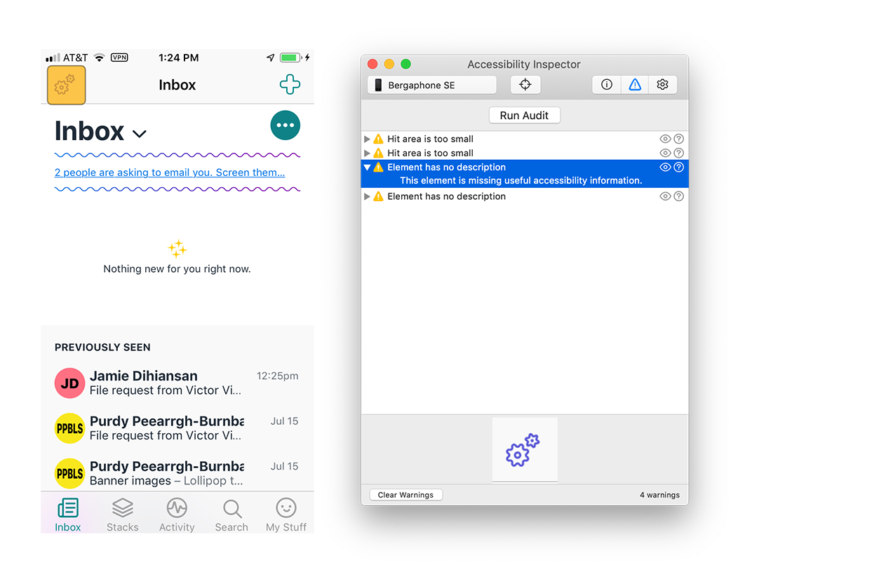

# iOS: How to develop and test for accessibility

Validating iOS app accessibility can be accomplished using Xcode Accessibility Inspector and the VoiceOver screen reader built into iOS. Before running through the app with VoiceOver it's useful to run Accessibility Inspector to fix any obvious issues.

1. [Use Xcode Accessibility Inspector to ensure tap targets are big enough, elements have descriptions, and text can be resized](#use-xcode-accessibility-inspector-to-ensure-tap-targets-are-big-enough-elements-have-descriptions-and-text-can-be-resized)
   1. [Support dynamic text sizing](#support-dynamic-text-sizing)
2. [Make sure Navigation is clear for those using assistive technology](#make-sure-navigation-is-clear-for-those-using-assistive-technology)
3. [Use custom actions to reduce repetition, cognitive load, and simplify the user experience](#use-custom-actions-to-reduce-repetition-cognitive-load-and-simplify-the-user-experience)
4. [Run through the app using VoiceOver to make sure everything works as expected](#run-through-the-app-using-voiceover-to-make-sure-everything-works-as-expected)

---

## Use Xcode Accessibility Inspector to ensure tap targets are big enough, elements have descriptions, and text can be resized

*Who is this for?* People using a screen reader, low vision, and those using iOS accessibility features like resizable text.

This tool from Apple is useful to run throughout the course of development. It's accessed from within Xcode (Xcode menu > Open Developer Tool > Accessibility Inspector) and can be used against either simulator or the app running on a connected device.

Inside of Accessibility Inspector choose the second tab labeled *Audit*, then click "Run Audit" and wait for failures to populate. Here's a look at a sample report:

As you select failures in Accessibility Inspector they're simultaneously highlighted on the target (simulator or hardware device).

Check out Apple's [2019 WWDC talk](https://developer.apple.com/videos/play/wwdc2019/257/) for more about Accessibility Inspector!

---

### Support dynamic text sizing

*Who is this for?* People with low vision.

Dynamic text allows people to globally increase or decrease the size of text on their device, due to preference or need.

#### Dynamic text principles
1. Make as much text dynamic as possible: If it can grow, it should grow.
2. Use as much of the screen **width** as possible
3. **Don't** truncate text as it grows: Display the same amount of text as the default UI.
4. Scale glyphs that appear next to text so that the UI continues to appear balanced.

After setting up dynamic type in Xcode, you can preview the results in Simulator using the Environmental Overrides feature (Xcode 11).

See Apple's document about [Scaling Fonts Automatically](https://developer.apple.com/documentation/uikit/uifont/scaling_fonts_automatically) and their [presentation about Visual Design and Accessibility from WWDC 2019](https://developer.apple.com/videos/play/wwdc2019/244/).

---

## Make sure Navigation is clear for those using assistive technology

*Who is this for?* Blind and low vision people using VoiceOver, people with motor function challenges using switch controls.

**Using Xcode 11:** Going back to Accessibility Inspector, choose the first "Inspection" tab, then the ▶️ button automatically progress through each element on the page.

Things to note as this runs:

* Does the focus order of elements make sense?
* Does the description of each element make sense?

---

## Use custom actions to reduce repetition, cognitive load, and simplify the user experience

*Who is this for?* Blind and low vision people using VoiceOver, people with motor function challenges using switch controls, Full Keyboard Access, and Voice Control.

By adding in custom actions we can significantly reduce the number of taps required to accomplish common tasks. A good example is for list-based views like the Haystack Inbox. Bubbling up custom actions for pinning, deleting, etc. onto each message line is far more usable than discovering gesture-based interactions.

**Note:** Be sure to set `isAccessibilityElement = false` on controls where this has been implemented to hide them from assistive technology.

Check out Apple's [2019 WWDC talk about custom actions](https://developer.apple.com/videos/play/wwdc2019/250/) to learn more!

---

## Run through the app using VoiceOver to make sure everything works as expected

VoiceOver is the screen reader built into iOS. Check out [this tutorial](https://www.imore.com/how-use-voiceover-iphone-and-ipad) for a good introduction on how to use it. In it's simplest form you turn on VoiceOver, then swipe left-to-right to move through each element on the page, and double-tap to activate the control. It might seem a bit daunting to use at first but the basics aren't all that complicated in practice.
