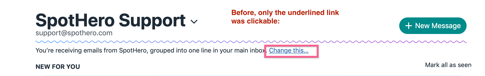
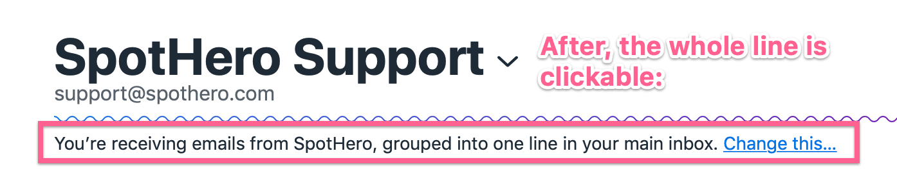

# How to design for accessibility on the web

- [1. Make sure links convey the full context of the action](#1-Make-sure-links-convey-the-full-context-of-the-action)
- [2. Hide SVGs (like avatars) and other decorative elements from screen readers](#2-Hide-SVGs-like-avatars-and-other-decorative-elements-from-screen-readers)

---
## 1. Make sure links convey the full context of the action

*Who is this for?* People using a screen reader

When someone using a screen reader lands on a link with a name such as *"click here"*, that's all the screen reader will announce and the context of the action isn't clear. To improve this, wrap the entire line in a link so the full context of the action is conveyed.

---

## 2. Hide SVGs (like avatars) and other decorative elements from screen readers

*Who is this for?* People using a screen reader

Often times avatars are redundant to the text content accompanying them. The same is true for decorative elements like horizontal rules. To improve the experience for someone using a screen reader, add the `aria-hidden="true"` attribute to remove these elements (and their children) from the accessibility tree. More about this [via Scott O'Hara](https://www.scottohara.me/blog/2019/05/22/contextual-images-svgs-and-a11y.html).

>It’s important to understand that ARIA can only affect the *semantics* of an element; it has no effect on the *behavior* of the element. While you can make an element hidden to screen readers with `aria-hidden=”true”`, that does not change the focus behavior for that element. For offscreen interactive content, you will often need to combine `aria-hidden=”true”` and `tabindex=”-1”` to make sure it’s truly removed from the keyboard flow. The proposed [inert attribute](https://github.com/WICG/inert) aims to make this easier by combining the behavior of both attributes. (Via [Google accessibility docs](https://developers.google.com/web/fundamentals/accessibility/how-to-review))