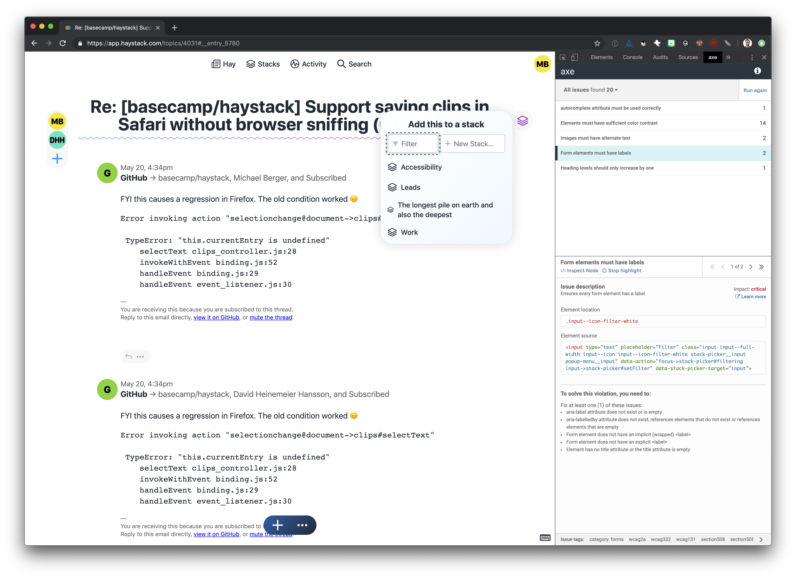

# How to audit for accessibility on the web

- [1. Scan for violations using a browser extension](#1-Scan-for-violations-using-a-browser-extension)
- [2. Every focusable element on the page should have an outline or other visible indicator of focus.](#2-Every-focusable-element-on-the-page-should-have-an-outline-or-other-visible-indicator-of-focus)
- [3. Make sure heading levels are semantic](#3-Make-sure-heading-levels-are-semantic)
- [4. Check color contast](#4-Check-color-contast)
    - [Tools for checking contrast levels](#Tools-for-checking-contrast-levels)
- [5. Hide decorative elements from assistive technology](#5-Hide-decorative-elements-from-assistive-technology)

---

## 1. Scan for violations using a browser extension

*Who is this for?* General accessibility/usability

There are a few browser extensions designed to detect accessibility issues, and explain how to fix them. Keep in mind these won't catch *all* accessibility issues, only a subset of them.

- My current favorite for Chrome and Firefox is [axe](https://www.deque.com/axe/)
- [Chrome's built-in accessibility audit](https://developers.google.com/web/tools/chrome-devtools/accessibility/reference)
- [tota11y](https://khan.github.io/tota11y/), an accessibility (a11y) visualization toolkit from Khan Academy.
- [Lighthouse](https://developers.google.com/web/tools/lighthouse/) auditing tool, built directly into Google Chrome!
- And [Firefox's integrated accessibility checker](https://developer.mozilla.org/en-US/docs/Tools/Accessibility_inspector)

Here's what a example report from axe looks like:

The column on the right lists all of the accessibility violations. When you select a violation and click the "Highlight" control, the respective element will be called out:

---

## 2. Every focusable element on the page should have an outline or other visible indicator of focus.

*Who is this for?* Users with low vision

This is pretty simple to check. Just tab through each screen and make sure every element you land on has an outline or other visual indicator of focus.

---

## 3. Make sure heading levels are semantic

*Who is this for?* People using a screen reader

For someone using a screen reader, heading levels are important for getting an overview of the structure of a page. Therefore, heading levels should first and foremost be used for semantics, and only secondarily for styling.

While the extensions in Section 1 will include heading level violations, the [headingsMap](https://chrome.google.com/webstore/detail/headingsmap/flbjommegcjonpdmenkdiocclhjacmbi?hl=en) Chrome extension is an easy way to review heading levels in one spot. Here's what a sample report looks like:

---

## 4. Check color contast

*Who is this for?* People with low vision and color blindness

When the contrast of an element is too similar to that of another its background or label it can be difficult to see. These failures will get raised by the browser extensions, through they're clear to point out when an element's background color could not be determined due to a background image.

WCAG 2 level AA requires a contrast ratio of at least `4.5:1` for normal text and `3:1` for large text, and a contrast ratio of at least `3:1` for graphics and user interface components (such as form input borders).

Level AAA requires a contrast ratio of at least `7:1` for normal text and `4.5:1` for large text.
Large text is defined as 14 point (typically 18.66px) and bold or larger, or 18 point (typically 24px) or larger.

#### Tools for checking contrast levels

- [In Chrome dev tools, viewing the contrast ratio of a text element in the Color Picker](https://developers.google.com/web/tools/chrome-devtools/accessibility/reference#contrast)
- [ColorZilla for Firefox](https://www.colorzilla.com/firefox/)
- [Contrast Mac app](https://usecontrast.com)

---

## 5. Hide decorative elements from assistive technology

*Who is this for?* People using a screen reader

Elements that serve only a purpose visually or repeat information that's conveyed via alternate means, such as by a nearby text label, should be hidden from screen readers to prevent annoying redudancy. Some common examples include horizontal rule `
` elements, or avatars when the name of the person they refer to are repeated nearby.

It's easiest to test this out by [navigating through the page using a screen reader](https://github.com/basecamp/accessibility/blob/master/how-to-use-a-screen-reader.md). When you determine that an element should be omitted, add the attribute `aria-hidden="true"` to hide it from the accessibility tree. Then re-test using a screen reader to make sure this changes what you were intending.
