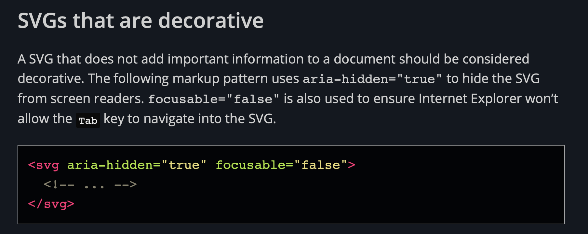
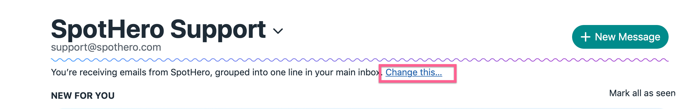

# Techniques

- [Hiding SVGs (like avatars) from screen readers](#Hiding-SVGs-like-avatars-from-screen-readers)
- [Mixed decorated + undecorated links](#Mixed-decorated--undecorated-links)

## Hiding SVGs (like avatars) from screen readers
[via Scott O'Hara](https://www.scottohara.me/blog/2019/05/22/contextual-images-svgs-and-a11y.html)

## Mixed decorated + undecorated links
This is useful when you want part of the link to be decorated, such as "click here", but the explanatory text before the link is necessary for someone using a screen reader.

*Example:* ["Change this" button isn't self explanatory for people using a screen reader](https://3.basecamp.com/2914079/buckets/11898988/todos/1851452489) via Haystack: Bundles

*Technique:* https://github.com/basecamp/haystack/commit/6e9c6f350d92176cd922c7583edf07ff2db1a00a

